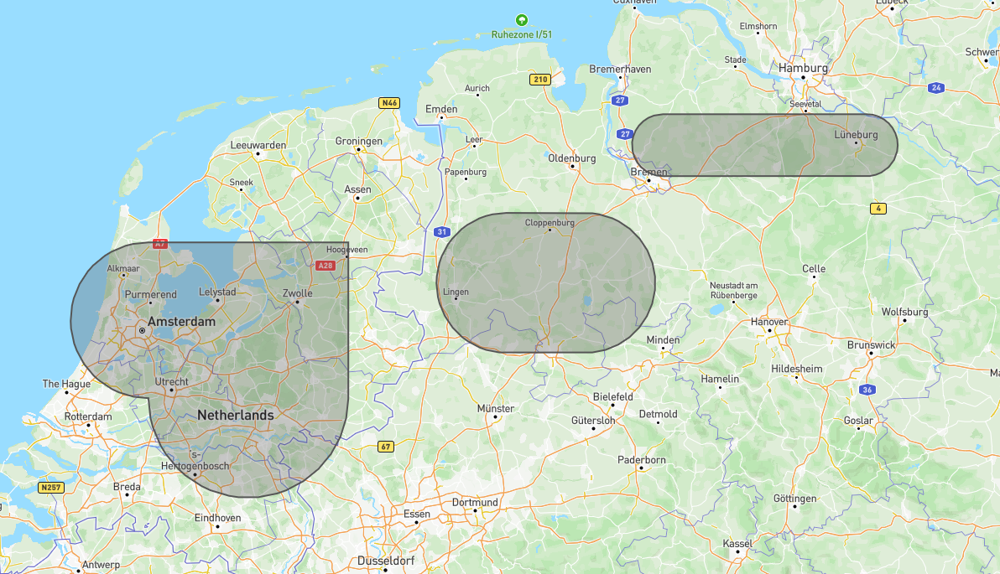

# Circle Insertion Tool

The Circle Insertion Tool is a Python program that allows you to insert circles between specified points in polygonal geometries stored in a GeoJSON file.

Before:


After:



## Installation

1. **Clone the repository:**

    ```
    git clone https://github.com/montralis/geoJson_converter.git
    cd geoJson_converter
    ```

2. **Install the required dependencies:**

    ```
    pip install -r requirements.txt
    ```

## Usage

1. **Prepare your GeoJSON data:**

   Make sure you have a GeoJSON file named `data.geojson` containing polygons. Each polygon should be represented as a list of coordinates.

2. **Create a configuration file:**

   Create a `config.json` file where you specify which polygons you want to modify and between which points you want to insert circles. The format of the configuration should be as follows:

   ```json
   [
       {
           "polygonnumber": 1,
           "insertBetween": [[1, 2], [3, 4]]
       },
       {
           "polygonnumber": 2,
           "insertBetween": [[5, 6], [3, 4]]
       }
   ]

## Run the program:
    python main.py
    
The program will read the data.geojson file, apply the circle insertion based on the configuration in config.json, and create a new GeoJSON file named with_circle.geojson.

## Contributing:
Contributions are welcome! If you find any issues or want to improve the program, feel free to submit a pull request or open an issue.


## License

This project is licensed under the MIT License - see the LICENSE file for details.


